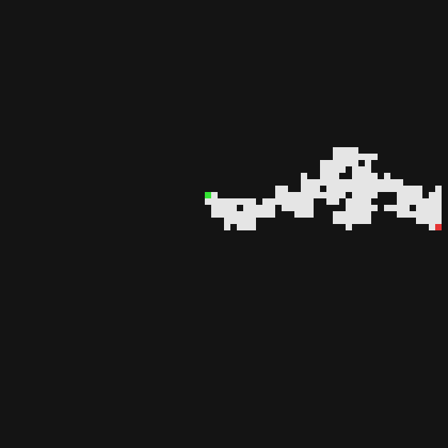
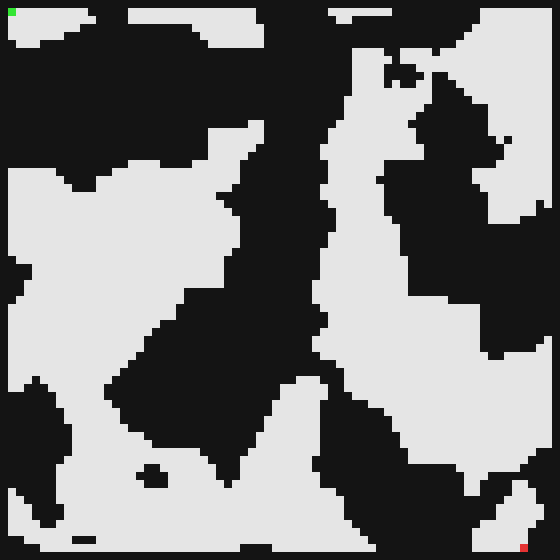
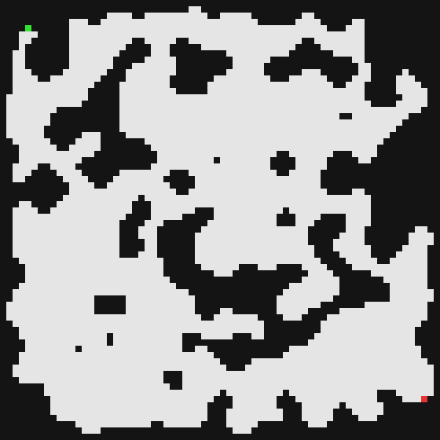
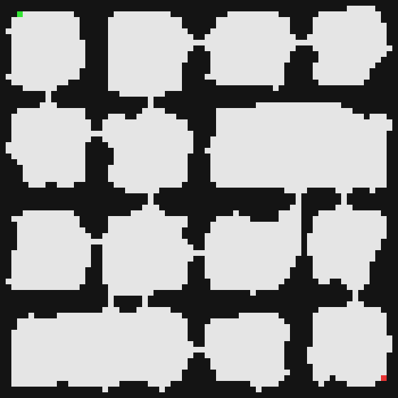
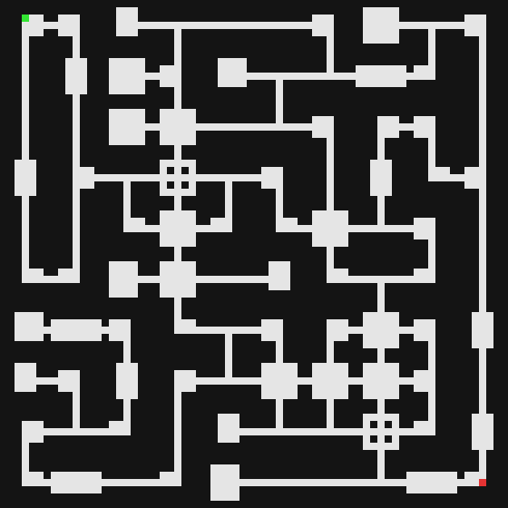

# Procedural 2D Map Generation Analysis in Godot

Research and benchmarking environment for comparing procedural 2D map generation algorithms in **Godot 4.5**.

The project was developed as part of the master's thesis:

**“Analiza algorytmów proceduralnego generowania map 2D w Godot”**  
(*Analysis of Procedural 2D Map Generation Algorithms in Godot*)

The environment provides a common interface for multiple procedural generation techniques, reproducible seed-based testing, structural map analysis, batch execution, and CSV/PNG export.

---

## Overview

Procedural map generation algorithms often produce structures with very different properties and expose very different configuration parameters. Direct comparison is therefore difficult unless their output is converted to a common representation and evaluated using the same metrics.

This project provides a unified testing pipeline for five generation methods:

- Random Walk
- Perlin Noise using `FastNoiseLite`
- Cellular Automata
- ProcGenHybrid
- Module-based Wave Function Collapse

Regardless of the original generation method, maps are converted to the same binary representation:

- `0` — wall
- `1` — walkable floor

The resulting maps can then be processed, analyzed, visualized, and exported using the same infrastructure.

The environment supports both:

- **single generation**, intended for visual inspection and parameter testing,
- **batch generation**, intended for quantitative experiments.

---

## Example Results

| Random Walk | Perlin Noise | Cellular Automata |
|---|---|---|
|  |  |  |

| ProcGenHybrid | ModuleWFC |
|---|---|
|  |  |

---

# Features

The testing environment provides:

- five procedural map generators behind a common generator interface,
- deterministic generation using explicit seeds,
- optional random seed generation,
- sequential seeds for reproducible batch experiments,
- configurable generator-specific parameters,
- common endpoint selection,
- structural and path-based map metrics,
- entropy and local-pattern metrics,
- connected-region analysis,
- generator-specific metrics for ProcGenHybrid and ModuleWFC,
- single-run map preview,
- PNG export,
- CSV export,
- configurable batch size,
- configurable maximum number of PNG files exported from a batch,
- fallback handling for failed WFC and ProcGenHybrid generation,
- reusable UI sections for generator parameters.

---

# Requirements

- **Godot Engine 4.5**
- GDScript
- Project dependencies and addon code referenced by the repository

The project uses Godot's built-in `FastNoiseLite` implementation for the Perlin Noise generator.

ProcGenHybrid integrates the ProcGen implementation used by the project and accesses selected internal BSP data to obtain additional topology information.

---

# Project Architecture

The main generation and analysis pipeline is:

```text
TestConfig
    │
    ▼
TestRunner
    │
    ├──────────────► Generator
    │                 │
    │                 ▼
    │             generated map
    │
    ▼
MapPostProcessor
    │
    ▼
MetricsCalculator
    │
    ├── MapValidator
    ├── RegionMetrics
    ├── ShapeMetrics
    └── EntropyMetrics
    │
    ▼
MapRenderer
    │
    ├── PNGExporter
    └── ResultLogger
```

The UI communicates with the system through `TestRunner`, rather than directly invoking individual generators.

This separation allows generator implementations to remain independent from analysis, visualization, and export logic.

---

# Main Components

## `TestConfig`

Stores all settings required by the testing environment.

It contains:

- common generation settings,
- seed configuration,
- batch configuration,
- export settings,
- generator-specific parameters,
- selected legacy/post-processing options.

Before generation, the configuration is converted to a `Dictionary` consumed by generator implementations.

---

## `TestRunner`

Coordinates the complete experiment pipeline.

Its responsibilities include:

1. selecting the requested generator,
2. preparing the run configuration,
3. measuring generation time,
4. invoking the generator,
5. applying common post-processing,
6. calculating metrics,
7. rendering the generated map,
8. exporting PNG and CSV results,
9. reporting progress to the UI.

Generation time intentionally measures only the generator execution.

The following operations are excluded from `generation_time_ms`:

- common post-processing,
- metric calculation,
- image rendering,
- PNG export,
- CSV export.

This prevents analysis and file I/O from influencing generator performance measurements.

---

## `BaseGenerator`

Defines the common interface implemented by all active generators.

Each generator provides:

```gdscript
func get_algorithm_name() -> String
```

and:

```gdscript
func generate_map(config: Dictionary) -> Dictionary
```

The returned map data contains at minimum the generated grid and generator metadata.

Additional generator-specific metadata may also be included.

---

## `MapPostProcessor`

Performs operations shared between generated maps after the generator has finished.

Its primary responsibility is common endpoint selection.

When enabled, it can also apply the legacy fixed start/end room option.

---

## `MetricsCalculator`

Coordinates metric calculation.

Common metrics are calculated for every map, while additional metrics are enabled when generator-specific metadata is available.

Specialized metric classes are used for separate analysis domains:

- `MapValidator` — walkability and shortest-path operations,
- `RegionMetrics` — connected floor regions and reachability,
- `ShapeMetrics` — floor/wall boundary complexity,
- `EntropyMetrics` — tile and local-pattern entropy.

---

## `MapRenderer`

Converts the binary map representation into an `Image`.

Default visualization:

- dark cells — walls,
- light cells — floors,
- green cell — start,
- red cell — end.

Rendering is independent from generation and is not included in generation-time measurements.

---

## `ResultLogger`

Handles CSV result export.

It supports:

- creation of new CSV files,
- appending single-run results,
- batch result export,
- dynamic header handling,
- serialization of common Godot value types.

---

## `PNGExporter`

Handles PNG export and creation of missing output directories.

---

# Generators

## Random Walk

`RandomWalkGenerator`

Random Walk begins from a selected map position and repeatedly moves one tile in one of four cardinal directions.

Every visited tile becomes walkable floor.

This naturally produces an irregular, continuous region centered around the trajectory of the walker.

### Main parameters

| Parameter | Description |
|---|---|
| `rw_steps` | Number of random movement steps |
| `rw_start_from_center` | Determines whether the walker starts from the map center |

The walker is restricted to the map interior, preserving a one-tile wall border.

Increasing the number of steps generally increases floor coverage, although repeated visits to already carved cells lead to saturation.

---

## Perlin Noise

`PerlinNoiseGenerator`

The generator samples a two-dimensional Perlin noise field using Godot's `FastNoiseLite`.

Each tile is classified according to a threshold:

```text
noise value < threshold  → floor
noise value >= threshold → wall
```

The outermost map cells are subsequently forced to walls.

### Main parameters

| Parameter | Description |
|---|---|
| `noise_frequency` | Spatial frequency of the noise field |
| `noise_threshold` | Threshold separating floor from wall |
| `noise_fractal_octaves` | Number of fractal noise octaves |

Frequency primarily influences the spatial scale of generated structures, while the threshold strongly affects the amount of walkable space.

---

## Cellular Automata

`CellularAutomataAdapter`

This generator adapts the Cellular Automata approach used by the analyzed `Procedural-Map-Generator` implementation.

Generation consists of:

1. random wall/floor initialization,
2. forced border creation,
3. repeated neighborhood-based smoothing,
4. preservation of the floor component associated with the central map area.

The smoothing rule uses the eight-cell Moore neighborhood.

For a configured threshold `T`:

```text
wall neighbors < T  → floor
wall neighbors > T  → wall
wall neighbors = T  → preserve previous state
```

Positions outside the map are treated as walls during neighborhood counting.

### Main parameters

| Parameter | Description |
|---|---|
| `ca_fill_probability` | Initial probability of a cell becoming a wall |
| `ca_iterations` | Number of smoothing iterations |
| `ca_border_width` | Width of the forced wall border |
| `ca_wall_threshold` | Wall-neighbor threshold used by the smoothing rule |

The adapter preserves the center-component filtering behavior of the analyzed generator independently from optional testing-environment reachability settings.

---

## ProcGenHybrid

`ProcGenHybridAdapter`

ProcGenHybrid combines several procedural generation techniques exposed by the ProcGen implementation.

The generation process includes:

- BSP-based spatial subdivision,
- room generation,
- corridor construction,
- additional corridor cycles,
- cellular-automata-based shaping,
- optional flood filling and structural expansion.

The adapter converts ProcGen's internal representation into the common binary grid used by the testing environment.

### Room parameters

| Parameter | Description |
|---|---|
| `procgen_room_amount` | Target room count |
| `procgen_room_min_coverage` | Minimum room coverage of its generation zone |
| `procgen_room_max_coverage` | Maximum room coverage of its generation zone |
| `procgen_room_center_ratio` | Controls room placement toward zone centers |
| `procgen_room_min_squared_ratio` | Minimum room squared-ratio constraint |
| `procgen_room_max_squared_ratio` | Maximum room squared-ratio constraint |

### Space subdivision parameters

| Parameter | Description |
|---|---|
| `procgen_zone_split_max_ratio` | Maximum zone split ratio |
| `procgen_zone_parent_inverse_orientation_chance` | Probability of reversing the parent split orientation |

### Corridor parameters

| Parameter | Description |
|---|---|
| `procgen_corridor_cycle_chance` | Probability of additional corridor connections |
| `procgen_corridor_edge_overlap_min_ratio` | Minimum required corridor-edge overlap |

### Cellular Automata parameters

| Parameter | Description |
|---|---|
| `procgen_automaton_iterations` | Number of automaton iterations |
| `procgen_automaton_noise_rate` | Noise introduced during automaton shaping |
| `procgen_automaton_flood_fill` | Enables ProcGen flood filling |
| `procgen_automaton_cell_min_neighbors` | Lower neighborhood parameter |
| `procgen_automaton_cell_max_neighbors` | Upper neighborhood parameter |
| `procgen_automaton_smoothing_step_cell_min_neighbors` | Smoothing neighborhood parameter |

### Expansion parameters

| Parameter | Description |
|---|---|
| `procgen_automaton_zones_fixed_outline_expand` | Zone outline expansion |
| `procgen_automaton_corridor_fixed_width_expand` | Fixed-width corridor expansion |
| `procgen_automaton_corridor_non_fixed_width_expand` | Non-fixed-width corridor expansion |

Automaton threading is intentionally disabled:

```text
automaton_threads = 0
```

This reduces execution variability during performance measurements.

When automaton iterations are disabled, the effective automaton noise rate is forced to zero.

### ProcGen topology metadata

The adapter additionally extracts room-link information from ProcGen's internal BSP graph.

This data is not treated as a metric directly. It is passed to `MetricsCalculator`, which derives ProcGen-specific structural measurements from it.

This implementation depends on selected internal ProcGen structures and is therefore isolated inside `ProcGenHybridAdapter`.

---

## Module Wave Function Collapse

`ModuleWFCGenerator`

ModuleWFC is a custom module-based implementation of Wave Function Collapse.

Instead of operating directly on individual tiles, generation occurs on a higher-level grid of predefined modules.

Modules are loaded from:

```text
res://data/wfc/modules_7x7.json
```

Each module contains:

- a binary tile grid,
- directional connection information,
- generation weight,
- semantic tags,
- optional scale classification.

### Module compatibility

Two neighboring modules are compatible when their corresponding edges agree:

```text
up    ↔ down
right ↔ left
down  ↔ up
left  ↔ right
```

For example, a module with an open right edge may only neighbor a module with an open left edge.

### Generation process

Each attempt performs:

1. initialization of all WFC cells,
2. application of boundary constraints,
3. initial constraint propagation,
4. selection of a minimum-entropy unresolved cell,
5. weighted module selection,
6. propagation of the new constraint,
7. repetition until the grid collapses or a contradiction occurs,
8. conversion of modules to the final tile grid,
9. structural validation,
10. semantic composition validation.

If an attempt fails, generation can restart from a fresh WFC state.

### Main parameters

| Parameter | Description |
|---|---|
| `wfc_module_grid_width` | Number of modules horizontally |
| `wfc_module_grid_height` | Number of modules vertically |
| `wfc_max_retries` | Maximum number of complete generation attempts |
| `wfc_min_small_corridors` | Minimum required small corridor modules |
| `wfc_min_medium_rooms` | Minimum required medium room modules |
| `wfc_min_large_rooms` | Minimum required large room modules |

### Output dimensions

ModuleWFC output dimensions are determined by:

```text
output width  = module grid width  × module size
output height = module grid height × module size
```

With 7×7 modules and an 8×8 module grid, the resulting map is:

```text
56 × 56 tiles
```

The common `width` and `height` configuration fields therefore do not directly determine ModuleWFC output dimensions.

### WFC validation

A collapsed layout must satisfy structural requirements before it is accepted.

The current implementation requires:

- at least 20 floor cells,
- a valid path between selected preview endpoints,
- at least 80% of floor cells in the largest connected component,
- configured minimum semantic module counts.

If no attempt satisfies all requirements but at least one complete collapsed layout was produced, the most recent collapsed map can be returned with:

```text
failed_generation = true
```

and diagnostic metadata describing the failed constraints.

If no complete collapsed layout is available, an all-wall fallback map is returned.

---

# Seed Handling and Reproducibility

Each generator supports deterministic seed-based generation.

When:

```text
random_seed = false
```

the configured seed is used directly.

For batch generation, deterministic seeds are derived from the base seed:

```text
run 0 → base_seed
run 1 → base_seed + 1
run 2 → base_seed + 2
...
```

For example:

```text
base seed = 100

run 0 → 100
run 1 → 101
run 2 → 102
run 3 → 103
```

When:

```text
random_seed = true
```

the generator replaces the supplied seed with a randomly generated value.

The actual seed used by the generator is stored in the result data and exported to CSV.

For reproducible experiments, disabling random seed generation is recommended.

---

# Endpoint Selection

After generation, common endpoint selection is performed by `MapPostProcessor` and `EndpointSelector`.

The system searches for walkable tiles near opposite map corners and assigns them as the final start and end positions used by common metrics.

This keeps endpoint selection independent from most generator implementations and allows path-related measurements to be calculated under a shared procedure.

Generator-specific temporary endpoints may still be used internally when they are required for generation-time validation, such as in ModuleWFC.

---

# Metrics

The environment calculates both common and generator-specific measurements.

## Basic metrics

| Metric | Description |
|---|---|
| `algorithm` | Generator identifier |
| `seed` | Actual seed used during generation |
| `map_width` | Generated map width |
| `map_height` | Generated map height |
| `total_cells` | Total tile count |
| `generation_success` | Whether generation completed without a reported failure |

---

## Performance metrics

| Metric | Description |
|---|---|
| `generation_time_ms` | Generator execution time in milliseconds |
| `time_per_cell_ms` | Generation time divided by total tile count |
| `time_per_floor_cell_ms` | Generation time divided by walkable tile count |

Generation timing excludes:

- post-processing,
- metric calculation,
- rendering,
- PNG saving,
- CSV saving.

---

## Floor coverage

| Metric | Description |
|---|---|
| `floor_count` | Number of walkable tiles |
| `wall_count` | Number of wall tiles |
| `floor_ratio` | Fraction of the map occupied by floor |
| `wall_ratio` | Fraction of the map occupied by walls |
| `floor_ratio_in_target_range` | Whether floor ratio falls within the configured analysis range |

The default target interval is:

```text
0.25 ≤ floor_ratio ≤ 0.65
```

This flag is an analytical convenience and should not be interpreted as a universal definition of map quality.

---

# Path Metrics

Path calculations use four-directional movement.

Diagonal movement is not allowed.

| Metric | Description |
|---|---|
| `has_valid_start` | Whether the selected start tile is walkable |
| `has_valid_end` | Whether the selected end tile is walkable |
| `is_connected` | Whether a path exists between start and end |
| `path_length` | Length of the shortest start-to-end path |
| `start_end_euclidean_distance` | Straight-line Euclidean distance between endpoints |
| `path_tortuosity` | Path length divided by Euclidean endpoint distance |
| `path_directness` | Euclidean endpoint distance divided by path length |
| `farthest_reachable_path_length` | Maximum shortest-path distance reachable from start |
| `farthest_reachable_x` | X coordinate of the farthest reachable floor tile |
| `farthest_reachable_y` | Y coordinate of the farthest reachable floor tile |

Path tortuosity is calculated as:

```text
path_tortuosity =
    path_length / start_end_euclidean_distance
```

A value closer to `1` indicates a path closer to the direct geometric distance.

Larger values indicate increasingly indirect or winding paths.

### Important note about `is_connected`

The historical result key:

```text
is_connected
```

means:

> a valid path exists between the selected start and end positions.

It does **not** mean that every floor tile on the map belongs to one globally connected component.

Global floor fragmentation is represented by the region metrics described below.

The key is retained for compatibility with existing experimental result files.

---

# Region and Reachability Metrics

Connected regions are calculated using four-directional floor adjacency.

| Metric | Description |
|---|---|
| `open_region_count` | Number of connected floor components |
| `largest_open_region_area` | Number of floor tiles in the largest component |
| `largest_open_region_ratio` | Fraction of all floor tiles contained in the largest component |
| `average_open_region_area` | Average connected floor-component size |
| `reachable_floor_count_from_start` | Number of floor tiles reachable from start |
| `reachable_floor_ratio_from_start` | Fraction of floor tiles reachable from start |
| `unreachable_floor_count` | Number of floor tiles unreachable from start |
| `unreachable_floor_ratio` | Fraction of floor tiles unreachable from start |

A globally connected non-empty floor layout generally has:

```text
open_region_count = 1
```

---

# Shape Metrics

## Normalized perimeter

The map boundary is approximated by counting cardinal floor-to-wall adjacencies.

Map boundaries outside the generated grid are treated as walls.

The metric:

```text
normalized_perimeter
```

normalizes this boundary count by the number of floor cells.

Higher values generally indicate more fragmented, narrow, or geometrically irregular floor structures.

Lower values generally indicate more compact structures.

This is a structural descriptor, not a direct quality score.

---

# Entropy Metrics

## Tile entropy

`tile_entropy` calculates Shannon entropy over the binary tile distribution.

Because the map contains two tile states, the theoretical maximum is:

```text
1 bit
```

`tile_entropy_normalized` expresses the same value on a normalized scale.

---

## 2×2 pattern entropy

`pattern_entropy_2x2` analyzes overlapping local 2×2 tile configurations.

A binary 2×2 block has:

```text
2^4 = 16
```

possible patterns.

The maximum Shannon entropy is therefore:

```text
log2(16) = 4 bits
```

`pattern_entropy_2x2_normalized` divides the raw value by this theoretical maximum.

Higher pattern entropy indicates greater local pattern diversity.

It does **not** automatically mean that a map is better, more playable, or more visually attractive.

---

# Declared Room Metrics

Generators capable of explicitly reporting room structures can provide room metadata.

The common room metrics are:

| Metric | Description |
|---|---|
| `declared_room_count` | Number of explicitly reported rooms |
| `largest_declared_room_area` | Area of the largest reported room |

Algorithms that do not explicitly represent rooms normally report zero for these values.

---

# ProcGenHybrid-Specific Metrics

ProcGenHybrid exposes additional room-topology metadata.

| Metric | Description |
|---|---|
| `procgen_corridor_link_count` | Number of extracted room connections |
| `procgen_dead_end_room_count` | Number of rooms with graph degree 1 |
| `procgen_room_connection_min_degree` | Minimum room degree |
| `procgen_room_connection_max_degree` | Maximum room degree |
| `procgen_room_connection_average_degree` | Mean room degree |
| `procgen_cycle_link_count` | Estimated number of links beyond a tree structure |
| `procgen_has_cycles` | Whether additional cycle-producing links are present |

Cycle-related metrics assume that the extracted room graph can be interpreted relative to a connected tree requiring:

```text
N - 1
```

links for `N` rooms.

These metrics are generator-specific and should not be directly interpreted as common map metrics.

---

# ModuleWFC-Specific Metrics

ModuleWFC exposes semantic information from collapsed module definitions.

| Metric | Description |
|---|---|
| `room_module_count` | Modules tagged as rooms |
| `corridor_module_count` | Modules tagged as corridors |
| `junction_module_count` | Modules tagged as junctions |
| `special_module_count` | Modules tagged as special |
| `small_room_count` | Small room modules |
| `medium_room_count` | Medium room modules |
| `large_room_count` | Large room modules |
| `dead_end_module_count` | Modules classified as dead ends |
| `dead_end_room_count` | Room modules classified as dead ends |
| `pass_through_room_count` | Room modules with two openings |
| `hub_room_count` | Room modules with at least three openings |

Additional WFC generation metadata may include:

```text
wfc_valid_layout
wfc_valid_composition
wfc_accepted_attempt
retry_count
fallback_reason
```

### `retry_count` compatibility note

The existing `retry_count` result field represents the number of generation attempts performed by ModuleWFC.

For example:

```text
successful first attempt  → retry_count = 1
successful third attempt  → retry_count = 3
```

The historical field name is retained for compatibility with existing experimental data.

Likewise, `wfc_max_retries` currently represents the maximum number of complete attempts rather than an initial attempt followed by that many additional retries.

---

# Single Generation

Single generation is intended primarily for:

- visual inspection,
- checking generator behavior,
- testing parameter combinations,
- inspecting individual metric values.

To generate a single map:

1. launch the project,
2. select a generator,
3. configure common settings,
4. configure generator-specific parameters,
5. choose seed behavior,
6. enable or disable PNG/CSV export,
7. press the single generation button.

The resulting map is displayed in the central preview panel.

Calculated metrics are displayed in the metrics panel.

---

# Batch Generation

Batch mode repeatedly invokes the selected generator under the same configuration.

The number of runs is controlled by:

```text
runs_per_algorithm
```

For deterministic seed mode, each run receives a sequential seed.

Example:

```text
base seed = 250
runs = 5
```

produces:

```text
250
251
252
253
254
```

Only a limited number of PNG files need to be stored during large experiments.

This is controlled through:

```text
max_pngs_per_batch
```

All quantitative batch results can still be written to CSV regardless of the PNG limit.

---

# Output Files

Generated PNG files are stored under:

```text
res://output/png/<algorithm>/
```

using filenames in the form:

```text
run_<index>_seed_<seed>.png
```

Example:

```text
res://output/png/RandomWalk/run_003_seed_103.png
```

CSV output is stored under:

```text
res://output/csv/
```

using filenames such as:

```text
RandomWalk_results_v2.csv
PerlinNoise_results_v2.csv
CellularAutomata_results_v2.csv
ProcGenHybrid_results_v2.csv
ModuleWFC_results_v2.csv
```

Required directories are created automatically when possible.

---

# Typical Experiment Workflow

A reproducible experiment can be performed as follows:

1. select a generator,
2. configure generator parameters,
3. disable random seed generation,
4. choose the initial seed,
5. choose the number of runs,
6. configure PNG and CSV export,
7. start batch generation,
8. allow the generator to produce each map,
9. apply common post-processing,
10. calculate metrics,
11. export the resulting data,
12. analyze CSV measurements together with representative PNG maps.

For parameter-sensitivity experiments, one parameter can be changed while the remaining parameters and seed sequence remain fixed.

Using the same seeds between configurations helps reduce variation caused only by random initialization.

---

# Legacy and Compatibility Options

Some options remain in the project because they were used during earlier development stages.

## Fixed start/end rooms

```text
use_fixed_start_end_rooms
```

When enabled, predefined 3×3 floor regions are introduced near opposite map corners.

This feature is retained for compatibility with earlier versions of the testing environment and is disabled by default.

It is not required for the final common endpoint-selection procedure.

---

## Reachable-area filtering

```text
keep_only_reachable_area_from_start
```

This option is retained from earlier stages of the environment.

In the current implementation it is handled internally by selected generators rather than by the common `MapPostProcessor`.

Its behavior should therefore not be interpreted as a universally applied post-processing operation across every generator.

It is disabled by default.

---

# Important Methodological Notes

The calculated metrics are intended to describe measurable structural characteristics of generated maps.

They do not constitute a universal map-quality function.

In particular:

- higher entropy is not inherently better,
- lower or higher floor coverage is not inherently better,
- higher path tortuosity is not inherently better,
- lower generation time does not imply better structural quality,
- generator-specific metrics should not be treated as directly equivalent to common metrics,
- visual readability and aesthetic quality are not completely captured by the numerical measurements,
- gameplay quality is not evaluated directly.

The purpose of the environment is therefore to expose trade-offs between procedural generation methods rather than identify one universally optimal algorithm.

---

# Project Structure

The active source code is organized by responsibility.

```text
res://
├── data/
│   └── wfc/
│       └── modules_7x7.json
│
├── scripts/
│   ├── analysis/
│   │   ├── EntropyMetrics.gd
│   │   ├── EndpointSelector.gd
│   │   ├── MapValidator.gd
│   │   ├── MetricsCalculator.gd
│   │   ├── RegionMetrics.gd
│   │   ├── ResultLogger.gd
│   │   └── ShapeMetrics.gd
│   │
│   ├── core/
│   │   ├── MapPostProcessor.gd
│   │   ├── MapTypes.gd
│   │   ├── TestConfig.gd
│   │   └── TestRunner.gd
│   │
│   ├── generators/
│   │   ├── BaseGenerator.gd
│   │   ├── CellularAutomataAdapter.gd
│   │   ├── ModuleLibrary.gd
│   │   ├── ModuleWFCGenerator.gd
│   │   ├── PerlinNoiseGenerator.gd
│   │   ├── ProcGenHybridAdapter.gd
│   │   └── RandomWalkGenerator.gd
│   │
│   ├── ui/
│   │   ├── CollapsibleSection.gd
│   │   └── MainUIController.gd
│   │
│   └── visual/
│       ├── MapRenderer.gd
│       └── PNGExporter.gd
│
└── output/
    ├── csv/
    └── png/
```

The exact scene and addon directories depend on the repository layout, but active testing logic is separated into the areas above.

---

# Extending the Environment

A new procedural generator can be integrated by extending `BaseGenerator`.

Example:

```gdscript
class_name ExampleGenerator
extends BaseGenerator


func get_algorithm_name() -> String:
	return "ExampleGenerator"


func generate_map(config: Dictionary) -> Dictionary:
	var grid: Array = []

	# Generate the binary floor/wall map here.

	return {
		"grid": grid,
		"rooms": [],
		"algorithm": get_algorithm_name(),
		"seed": int(config.get("seed", 0))
	}
```

The generator must then be registered in `TestRunner`:

```gdscript
generators = {
	# ...
	"ExampleGenerator": ExampleGenerator.new()
}
```

If the generator exposes additional semantic data, it can be added to the returned `Dictionary` and interpreted later by `MetricsCalculator`.

Generator-specific analysis should remain separate from the common metric pipeline whenever the data is not available for every algorithm.

---

# Design Principles

The project follows several implementation principles intended to support experimental comparison.

### Common representation

Every generator ultimately produces the same binary floor/wall map representation.

### Separation of responsibilities

Generation, post-processing, analysis, visualization, UI, and export are implemented as separate components.

### Reproducibility

Explicit seeds and deterministic batch sequences allow equivalent configurations to be reproduced.

### Generator isolation

Generator-specific behavior remains inside generator or adapter classes whenever possible.

### Comparable timing

Only generation execution is included in the primary generation-time measurement.

### Metric transparency

Metrics describe individual measurable properties instead of being combined into a single arbitrary quality score.

---

# Research Context

The environment was created to investigate how different procedural generation approaches behave under comparable experimental conditions.

The analysis focuses on trade-offs involving:

- generation performance,
- floor coverage,
- structural connectivity,
- fragmentation,
- endpoint accessibility,
- path length,
- path tortuosity,
- boundary complexity,
- local pattern diversity,
- sensitivity to generator parameters,
- controllability of generated structures.

The project is therefore primarily a **research and experimentation tool**, rather than a production-ready dungeon generation framework.

Its architecture is intentionally designed to make algorithms observable, configurable, and comparable.
